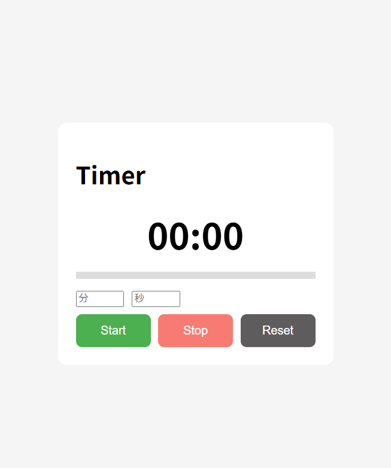
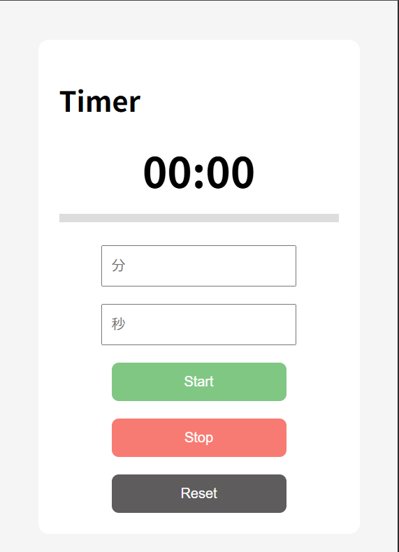

# タイマー

---

## Demo

[タイマーアプリはこちら](https://yaki-onigiri.github.io/03-timer)

---

## Source Code

[GitHub Repository](https://github.com/yaki-onigiri/03-timer)

---

## アプリ概要

分・秒を入力してカウントダウンを行うシンプルなタイマーアプリです。
**終了時刻ベースのロジックにより、ズレの少ない正確なタイマーを実現しています。**

一時停止・再開、ページリロード後の状態復元など、実用性を意識した設計を行っています。

また、スマートフォンでの操作性も考慮し、レスポンシブ対応を実装しています。

---

## アプリ画面

---

## Features（主な機能）

### 基本機能

- カウントダウンタイマー機能（分・秒入力）
- Start / Stop / Reset 機能
- タイマーの一時停止（Stop）・再開（Resume）
- アラーム通知機能

### 拡張機能

- ページリロード後の状態復元（localStorage）
- プログレスバーによる進行状況の可視化
- 残り時間に応じた色変化（60秒以下：オレンジ、10秒以下：赤）

### UX改善

- リアルタイムバリデーション（不正入力防止）
- レスポンシブデザイン対応（スマートフォン最適化）
- モバイル操作最適化

---

## 使用技術

・HTML：構造の定義

・CSS：レイアウト・レスポンシブ対応

・JavaScript (Vanilla JS)：ロジック・状態管理

---

## 技術的なポイント

本アプリでは、タイマーの精度改善を目的として「終了時刻ベース」のロジックを採用しています。

### ■ 終了時刻ベースのロジック

通常の「1秒ずつ減らす方式」ではなく、**「現在時刻」と「終了時刻」の差分から残り時間を算出する方式** を採用しています。

これにより、時間精度が維持される点が大きなメリットです。
また、タブ非アクティブ時やリロード後でも正確な残り時間を維持できます。

### ■ setTimeout による再起ループ制御

従来の `setInterval` ではなく、
**setTimeout を用いた再帰処理（tick関数）** に変更しています。

- 処理遅延によるズレの蓄積を防止
- タイマー停止の制御が明確化

### ■ 状態管理（Stateオブジェクト）

タイマーの状態をオブジェクトで一元管理しています。

- 状態の一元管理
- バグの発生防止
- 可読性の向上

### ■ 入力バリデーション機能の追加

ユーザーの入力に対してリアルタイムでチェックを行っています。

- 0秒スタート防止
- 最大60分制限
- 範囲制限（分：0～60、秒：0～59）
- 数字以外の入力防止

また、エラー時は画面内にメッセージを表示し、UXを改善しています。

### ■ レスポンシブ対応（モバイル最適化）

スマートフォンでの操作性を考慮し、UIを最適化しています。

- `@media (max-width: 480px)`によるモバイル最適
- Flexbox によるレイアウト設計
- 画面幅に応じたレイアウト切り替え（横並び → 縦並び）
- タップしやすいUI設計（ボタン・入力欄のサイズ調整）

これにより、スマホ・PCの両方で快適に操作できるUIを実現しています。

---

## How to Run

1. リポジトリをクローン
2. index.html をブラウザで開く（ダブルクリックでOK）

---

## フォルダ構成

.
├ index.html
├ css
│ └ style.css
├ js
│ └ script.js
├ README.md
└ docs
  ├ learning-note.md
  ├ dev-log.md
  └ screenshot
    ├ timer-app1.png
    └ timer-app2.png

---

## 工夫した点

・終了時刻ベースのロジックでタイマー精度を向上
・setTimeout の再帰処理によりズレ問題を解消
・state オブジェクトで状態管理を統一
・UI描画処理（render系）を分離し可読性向上
・localStorage により状態を永続化
・try-catch による例外処理で、データ破損時の停止を防止
・リアルタイムバリデーションでUX向上
・モバイル操作を考慮したUI設計（タップ領域の最適化）

---

## 作成者

GitHub: <https://github.com/yaki-onigiri>

---
